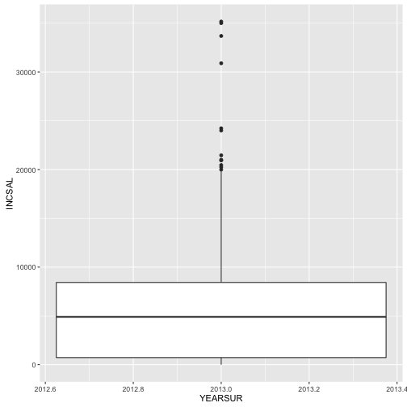
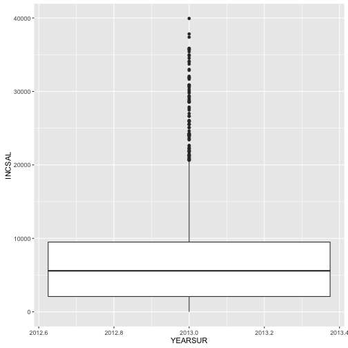
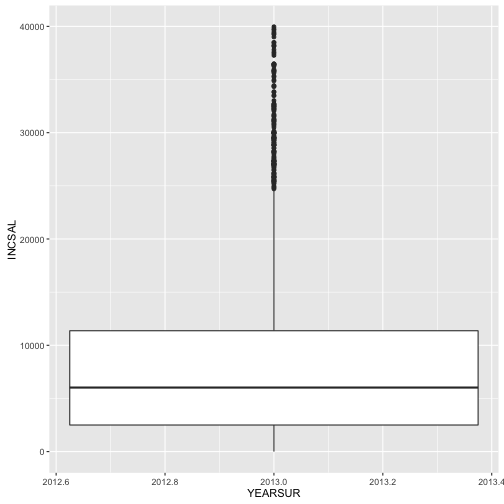

```r
library(ggplot2)
library(foreign)
library(Hmisc)
```

```
## Loading required package: lattice
```

```
## Loading required package: survival
```

```
## Loading required package: Formula
```

```
## 
## Attaching package: 'Hmisc'
```

```
## The following objects are masked from 'package:dplyr':
## 
##     combine, src, summarize
```

```
## The following objects are masked from 'package:base':
## 
##     format.pval, round.POSIXt, trunc.POSIXt, units
```

```r
library(reshape2)
```

```
## 
## Attaching package: 'reshape2'
```

```
## The following object is masked from 'package:tidyr':
## 
##     smiths
```

```r
library(dplyr)
library(tidyr)
file456 <- spss.get("/Users/AbuDavid/school/census/f456/f456ind.por", use.value.labels=TRUE)
```

```
## Warning in `levels<-`(`*tmp*`, value = if (nl == nL) as.character(labels)
## else paste0(labels, : duplicated levels in factors are deprecated
```
Begin with data from Public Use File 2014, file f456.

```r
                                        #
subSetInd2014<-dplyr::select(file456, YEARSUR, WPLDIST,INCSAL)
head(subSetInd2014)
```

```
##   YEARSUR  WPLDIST INCSAL
## 1    2014     <NA>      0
## 2    2014     <NA>      0
## 3    2014   Center   5555
## 4    2014 Gush Dan   8081
## 5    2014 Tel-Aviv   6446
## 6    2014 Tel-Aviv   3473
```

```r
summary(subSetInd2014)
```

```
##     YEARSUR         WPLDIST          INCSAL      
##  Min.   :2014   Center  : 3010   Min.   :     0  
##  1st Qu.:2014   Tel-Aviv: 2551   1st Qu.:     0  
##  Median :2014   North   : 1766   Median :     0  
##  Mean   :2014   Haifa   : 1522   Mean   :  3403  
##  3rd Qu.:2014   Gush Dan: 1468   3rd Qu.:  4749  
##  Max.   :2014   (Other) : 1516   Max.   :254219  
##                 NA's    :16117
```

```r
                                        names(subSetInd2014)
```

```
## [1] "YEARSUR" "WPLDIST" "INCSAL"
```

```r
                                        ggplot(aes(y=INCSAL,
                                                   x=YEARSUR
                                                    ),
                                   data=subSetInd2014)+geom_boxplot()
```


       Plot is stretched by very few individuals with extremely high incomes.
       
      Remove these to see the normal salaries more clearly.
       
       ```r
       richRemoved <- subSetInd2014
         # richRemoved[richRemoved$INCSAL > 1200,] #testSyntax
       count(richRemoved[richRemoved$INCSAL > 40000,]) # > $10k USD/month
       ```
       
       ```
       ## # A tibble: 1 × 1
       ##       n
       ##   <int>
       ## 1   130
       ```
       
       ```r
         # remove the 130 richest, regraph
       richRemoved<-richRemoved[richRemoved$INCSAL<40000,]
       # ggplot(aes(y=INCSAL,x=YEARSUR),
       #       data=richRemoved)+geom_boxplot()
       naRemoved <-richRemoved %>% filter(complete.cases(richRemoved))
        # ggplot(aes(y=INCSAL,  x=YEARSUR  ),
        #                                   data=naRemoved)+geom_boxplot()
       ```
    Here we look at the non-wealthy in the entire country, defined as those who make less than 40k NIS /month, approximately $10k USD/month.
    In shekels, their mean income is 7,488. The middle 50% of them have incomes lying between 2,344 and 10,234 NIS/month.
    
    ```r
      haifaData2014<-  naRemoved %>% filter(WPLDIST == "Haifa")
    ## ggplot(aes(y=INCSAL,
    ##            x=YEARSUR,
    ##            col="green"
    ##                                                     ),
    ##        data=haifaData)+geom_boxplot()
    ##   summary(haifaData)
    
      centerData2014 <-naRemoved %>% filter(WPLDIST == "Center")
      ## ggplot(aes(y=INCSAL,
      ##            x=YEARSUR,
      ##            col="blue"),
      ##        data=centerData)+geom_boxplot()
      ## summary(centerData)
    ```
    When looking at Haifa, the mean income falls by around 500 NIS to 6944,
    50% of incomes are between 2084 and 9448 NIS.  
    Mean income in the Center is around 500 NIS more than the national mean, and more than 1000 NIS more than the Haifa mean, at 8017. 
    50% of the non-wealthy in Center earn between 2582 and 11,000 NIS. The first quartile is 500 NIS above that of Haifa and the third quartile is 1150 NIS about that of Haifa (11,000 vs. 9448).
    Open new dataSet, Household Expenditure Survey 2013, in file f457.
    
    
    ```r
    judeaData2014<-  naRemoved %>% filter(WPLDIST == "Judea / Samaria")
    ## ggplot(aes(y=INCSAL,
    ##            x=YEARSUR,
    ##            col="orange"
    ##                                                     ),
    ##        data=judeaData)+geom_boxplot()
      summary(judeaData)
    ```
    
    ```
    ## Error in summary(judeaData): object 'judeaData' not found
    ```
    
    ```r
    areas <- c("Haifa","Center","Judea / Samaria")
    file457 <- spss.get("/Users/AbuDavid/school/census/f457/f457ind.por", use.value.labels=TRUE)
    ```
    
    ```
    ## Warning in `levels<-`(`*tmp*`, value = if (nl == nL) as.character(labels)
    ## else paste0(labels, : duplicated levels in factors are deprecated
    ```
    
    ```r
    subSetInd2013<-dplyr::select(file457, YEARSUR, WPLDIST,INCSAL)
     richRemoved2013<-subSetInd2013[subSetInd2013$INCSAL<40000,]
    naRemoved2013 <-richRemoved2013 %>% filter(complete.cases(richRemoved2013))
    judeaData2013<-  naRemoved2013%>% filter(WPLDIST == "Judea / Samaria")
    haifaData2013<-  naRemoved2013 %>% filter(WPLDIST == "Haifa")
    centerData2013<- naRemoved2013 %>% filter(WPLDIST == "Center")
    national2013<-naRemoved2013
    summary(national2013)
    ```
    
    ```
    ##     YEARSUR                WPLDIST         INCSAL     
    ##  Min.   :2013   Jerusalem      :1300   Min.   :    0  
    ##  1st Qu.:2013   North          :1857   1st Qu.: 2468  
    ##  Median :2013   Haifa          :1668   Median : 5690  
    ##  Mean   :2013   Center         :3335   Mean   : 7319  
    ##  3rd Qu.:2013   Tel-Aviv       :2987   3rd Qu.: 9837  
    ##  Max.   :2013   Gush Dan       :1582   Max.   :39967  
    ##                 Judea / Samaria: 315
    ```
    
    ```r
    summary(judeaData2013)
    ```
    
    ```
    ##     YEARSUR                WPLDIST        INCSAL     
    ##  Min.   :2013   Jerusalem      :  0   Min.   :    0  
    ##  1st Qu.:2013   North          :  0   1st Qu.:  725  
    ##  Median :2013   Haifa          :  0   Median : 4899  
    ##  Mean   :2013   Center         :  0   Mean   : 5977  
    ##  3rd Qu.:2013   Tel-Aviv       :  0   3rd Qu.: 8425  
    ##  Max.   :2013   Gush Dan       :  0   Max.   :35162  
    ##                 Judea / Samaria:315
    ```
    
    ```r
    summary(haifaData2013)
    ```
    
    ```
    ##     YEARSUR                WPLDIST         INCSAL     
    ##  Min.   :2013   Jerusalem      :   0   Min.   :    0  
    ##  1st Qu.:2013   North          :   0   1st Qu.: 2086  
    ##  Median :2013   Haifa          :1668   Median : 5584  
    ##  Mean   :2013   Center         :   0   Mean   : 7129  
    ##  3rd Qu.:2013   Tel-Aviv       :   0   3rd Qu.: 9496  
    ##  Max.   :2013   Gush Dan       :   0   Max.   :39938  
    ##                 Judea / Samaria:   0
    ```
    
    ```r
    summary(centerData2013)
    ```
    
    ```
    ##     YEARSUR                WPLDIST         INCSAL     
    ##  Min.   :2013   Jerusalem      :   0   Min.   :    0  
    ##  1st Qu.:2013   North          :   0   1st Qu.: 2500  
    ##  Median :2013   Haifa          :   0   Median : 6024  
    ##  Mean   :2013   Center         :3335   Mean   : 8040  
    ##  3rd Qu.:2013   Tel-Aviv       :   0   3rd Qu.:11368  
    ##  Max.   :2013   Gush Dan       :   0   Max.   :39967  
    ##                 Judea / Samaria:   0
    ```

```r
ggplot(aes(y=INCSAL,
           x=YEARSUR),
  data=judeaData2013)+geom_boxplot()
```

```
## Don't know how to automatically pick scale for object of type labelled/integer. Defaulting to continuous.
## Don't know how to automatically pick scale for object of type labelled/integer. Defaulting to continuous.
```



```r
ggplot(aes(y=INCSAL,
           x=YEARSUR
                       ),
       data=haifaData2013)+geom_boxplot()
```

```
## Don't know how to automatically pick scale for object of type labelled/integer. Defaulting to continuous.
## Don't know how to automatically pick scale for object of type labelled/integer. Defaulting to continuous.
```



```r
ggplot(aes(y=INCSAL,
           x=YEARSUR
                       ),
       data=centerData2013)+geom_boxplot()
```

```
## Don't know how to automatically pick scale for object of type labelled/integer. Defaulting to continuous.
## Don't know how to automatically pick scale for object of type labelled/integer. Defaulting to continuous.
```



```r
test1 <- head(centerData2013)
test2 <- head(haifaData2013)
test3 <- head(judeaData2013)
test6 <- head(centerData2014)
test4 <- head(haifaData2014)
test5 <- head(judeaData2014)
test <- rbind(test1, test2, test3, test4, test5, test6)

ggplot(aes(y=INCSAL,
           x=YEARSUR,
           col=WPLDIST
                       ),
       data=test)+geom_boxplot()
```

```
## Don't know how to automatically pick scale for object of type labelled/integer. Defaulting to continuous.
## Don't know how to automatically pick scale for object of type labelled/integer. Defaulting to continuous.
```


```r
#
# summary(test$INCSAL)
#
# mean(test1$YEARSUR)
# mean(test6$YEARSUR)
#
# 
```
